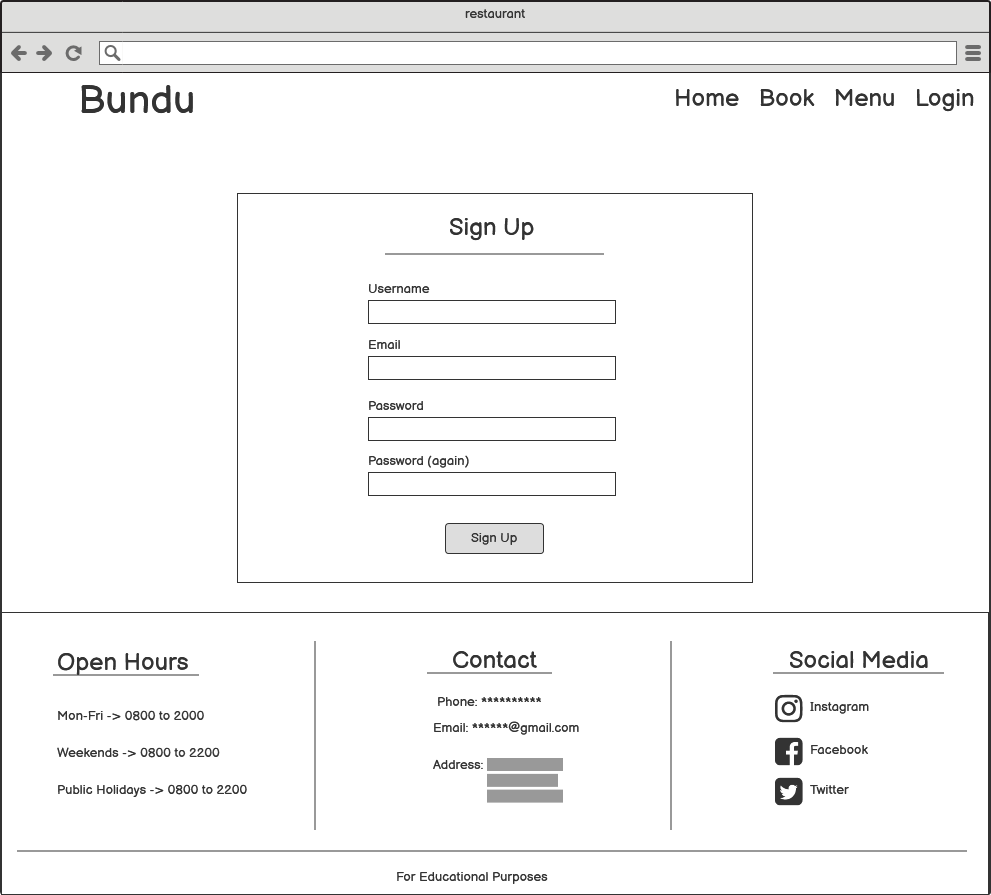
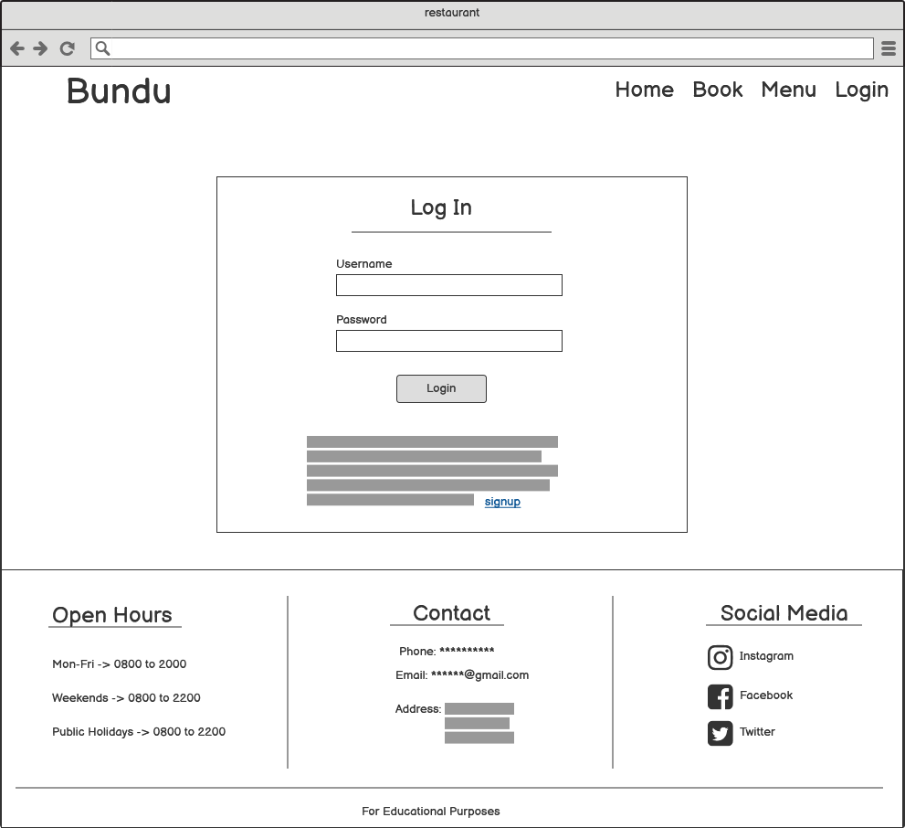
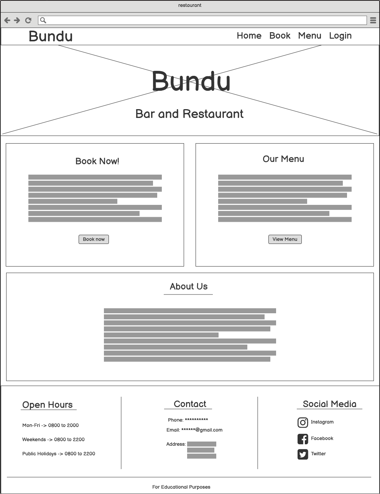
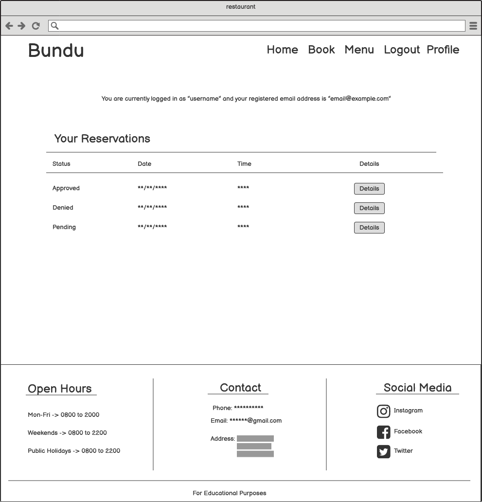
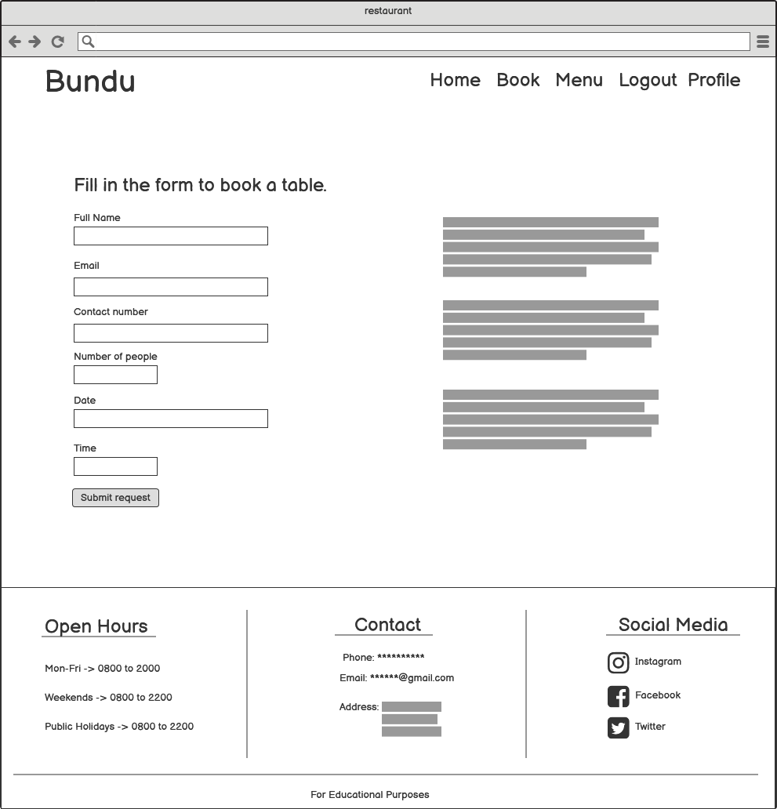
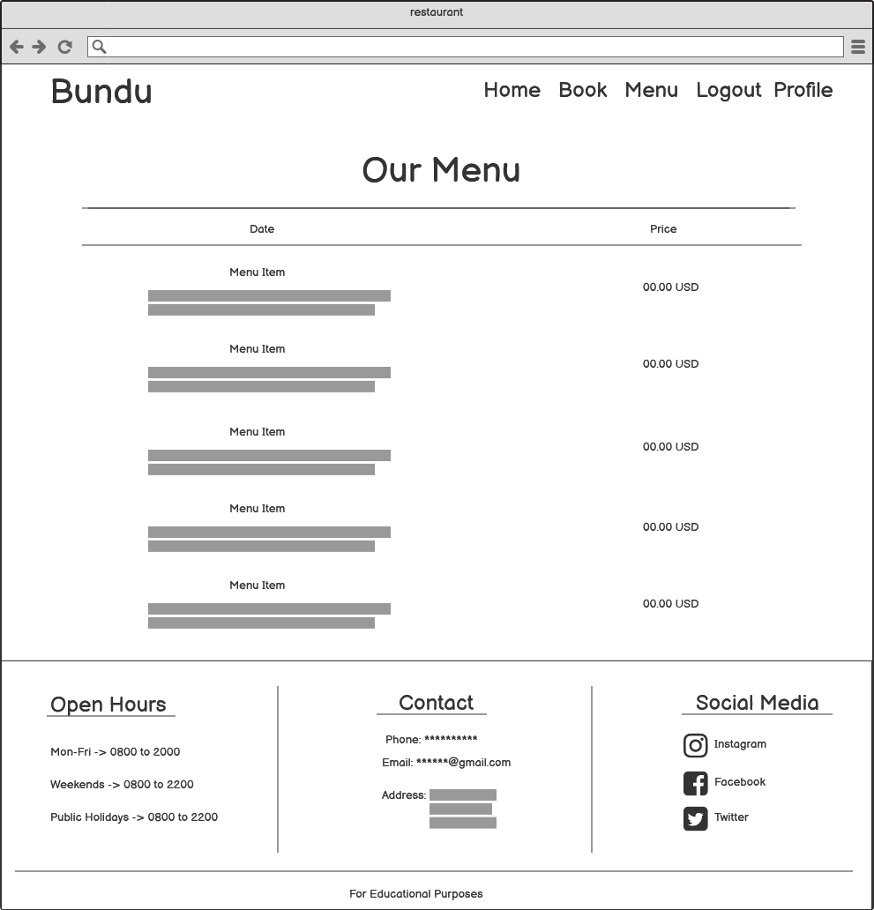
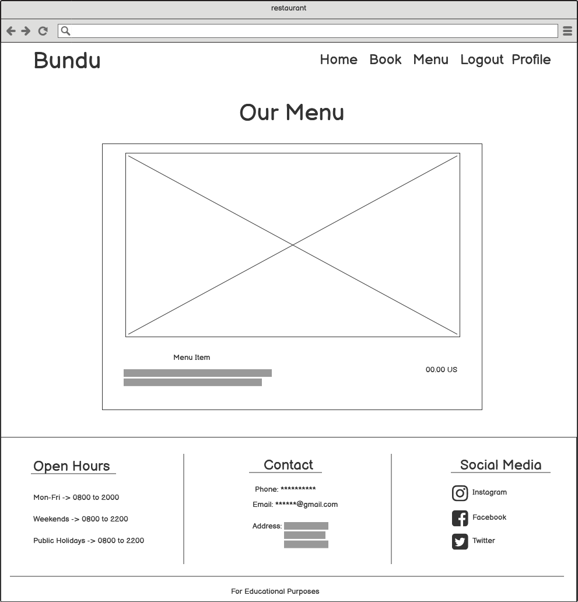
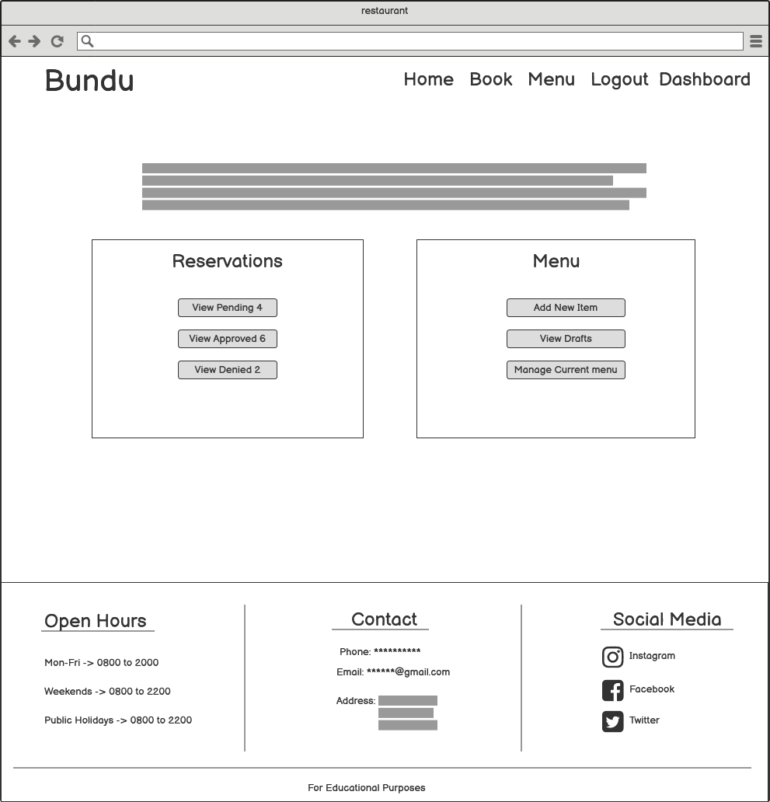
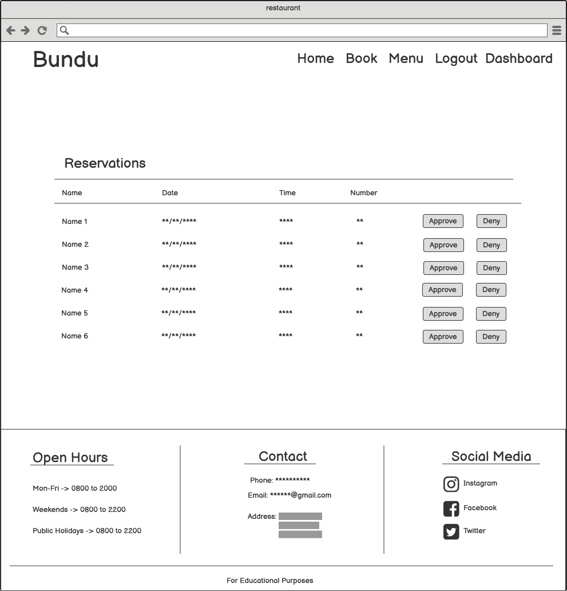

# Bundu Bar and Restaurant

The Bundu Bar and Restaurant site is intended to be used as an advertising and management site for the restaurant to attract customers by providing compelling and informational content as well as a way to make a reservation online. The site also aids the restaurant staff in handling reservations for the restaurant and provides the ability to have more manageable interactions with customers.

## Contents

## Project Goals

## User Experience
### Epics
### Customer User Stories
### Staff User Stories
### Site Owner User Stories

### Site Structure

#### Wireframes
I created basic wireframes of how I wanted the general layout of the site to look using [Balsamiq](https://balsamiq.com/). I created a wireframe for each main page layout and used it as a base to guide the way I structured and styled my pages. Although the site contains other pages, the layout is mostly the same and therefore I adopt their structure from these main wireframes.

##### Sign Up In Wireframe

##### Log In Wireframe

##### Home Page Wireframe

##### Profile Page Wireframe

##### Reservation Page Wireframe

##### Menu Page Wireframe

##### Menu Modal Wireframe

##### Staff Dashboard Page Wireframe

##### Staff Reservations Page Wireframe

### Design Choices

### Project Management

## Features
### Existing Features
### Future Features

## Technologies Used

## Python Packages Used

## Testing

## Deployment and Development
### Deployment
### Cloning The Repository
### Forking the Repository

## Credits
## Acknowledgements
