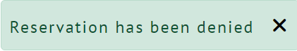

# Bundu Bar and Restaurant

The Bundu Bar and Restaurant site is intended to be used as an advertising and management site for the restaurant to attract customers by providing compelling and informational content as well as a way to make a reservation online. The site also aids the restaurant staff in handling reservations for the restaurant and provides the ability to have more manageable interactions with customers.

## Contents

## Project Goals
This site was developed for a fictional small restaurant to provide an easier way to manage reservations for both the restaurant staff and customers. The site also employs functionality for staff to manage the menu advertised to customers which allows control over what they offer as a restaurant.

This version of the project includes necessary functionality for customers and staff to provide a pleasant user experience. In the future, the site may be further developed to include more features that may become necessary as the restaurant grows.

This project was developed to showcase competency in web development particularly using the Django framework and agile methodology. It is purely for educational purposes.

## User Experience
### Epics
During the planning stage of the project I created 7 epics which I then broke down further into a total of 44 user stories. These can be found in the [project kanban board](https://github.com/users/Tony118g/projects/8) or they can be viewed individually through the links below.

1. [Initial Django Setup](https://github.com/Tony118g/bundu-restaurant/issues/1)
2. [User Account Management](https://github.com/Tony118g/bundu-restaurant/issues/2)
3. [User Reservation Management](https://github.com/Tony118g/bundu-restaurant/issues/3)
4. [Site Content Interaction](https://github.com/Tony118g/bundu-restaurant/issues/4)
5. [Staff Reservation Management](https://github.com/Tony118g/bundu-restaurant/issues/5)
6. [Staff Menu Management](https://github.com/Tony118g/bundu-restaurant/issues/6)
7. [User Menu Interaction](https://github.com/Tony118g/bundu-restaurant/issues/7)

### User Stories
The epics mentioned above were further broken down into user stories. These stories were developed using MoSCoW (must have, should have, could have, and won't have) prioritization and each story was assigned a label in accordance with its level of priority. Each story was also assigned user story points using labels. I assigned the story points based on my best estimation of the time and difficulty of completing each user story.

As well as labels, each user story has acceptance criteria and tasks associated with it. This was a great way of ensuring all requirements for each story were known as they were developed. This also helped keep track of progress.

A few user stories were created based on an ideal scenario of the project while it was known that it was highly unlikely they would be completed for this first development and release of the site. These stories were not essential to the project however I may revisit them in a future development along with any other features that may be required as the restaurant grows.

All user stories can be found in the [project kanban board](https://github.com/users/Tony118g/projects/8)

Below are the completed user stories for this version of the project's release listed by epic.

* Epic - initial django setup
    * As a developer I want to set up Django and install the initial supporting libraries needed so that I can begin development of the site.
    * As a developer I want to set up the environment to secure secret configuration variables so that I can ensure sensitive data is kept private.
    * As a developer I want to deploy the site to Heroku so that I can ensure the site works in a production environment and share the completed site publicly.

* Epic - user account management
    * As a user I can register an account so that I can log in and out of the site.
    * As a user I can log in and logout of my account so that I can use the site and keep my account secure
    * As a user I can view my account details so that I can be sure that I am using my account and in case I forget my details.
    * As a user I can edit my account details so that I can keep my account information up to date.
    * As a user I can delete my account so that I can remove my details and stop using the site at my will.
    * As a user I can change my password so that I can keep my account secure.
    * As a user I can reset my password so that I can still access my account if I forget my password.

* Epic - site content interaction
    * As a user I can view my account page so that I can view and manage information and reservations specific to me.
    * As a user I can view the restaurant menu so that I know what food options are available.
    * As a staff member I can view the staff dashboard so that I can manage the restaurant site and reservations.
    * As a site owner I want to restrict certain features to registered users so that it encourages people to register to the site and ensures reservations are recorded for known customers.
    * As a site owner I want to restrict certain features to staff members so that I can ensure unauthorized users cannot tamper with the running of the site.

* Epic - user reservation management
    * As a user I can make a reservation request so that I can reserve a time and place in the restaurant.
    * As a user I can receive feedback on whether my reservation has been approved or not so that I can visit the restaurant or make a new reservation.
    * As a user I can view my reservations so that I can be sure of my reservations.
    * As a user I can edit my reservations so that I can change reservation details if I want to.
    * As a user I can cancel my reservation so that I can avoid unnecessary reservations if I change my mind.

* Epic - staff reservation management
    * As a staff member I can view all reservations in categories so that I can manage all reservations that come through the site.
    * As a staff member I can view all reservations for the current date so that I know what to plan for on the day at the restaurant.
    * As a staff member I can search reservations according to their date so that I can find out the reservation status of the restaurant on a given date.
    * As a staff member I can search reservations pertaining to a name so that I can find out the reservation status of the restaurant for a given name.
    * As a staff member I can approve or deny reservations so that I can be in control of reservations at the restaurant.

* Epic - staff menu management
    * As a staff member I can add a menu item so that I can keep the menu up to date with new options.
    * As a staff member I can edit menu items so that I can ensure the correct menu information is displayed.
    * As a staff member I can delete menu items so that I can remove old menu items that are no longer relevant.
    * As a staff member I can mark a menu item as unavailable so that I can still display the item but inform customers that it is currently unavailable.

* Epic - user menu interaction
    * As a user I can view images of menu items so that I can visualize the food item.

### Site Structure

#### Wireframes
I created basic wireframes of how I wanted the general layout of the site to look using [Balsamiq](https://balsamiq.com/). I created a wireframe for each main page layout and used it as a base to guide the way I structured and styled my pages. Although the site contains other pages, the layout is mostly the same and therefore I adopt their structure from these main wireframes.

##### Sign Up In Wireframe

##### Log In Wireframe

##### Home Page Wireframe

##### Profile Page Wireframe

##### Reservation Page Wireframe

##### Menu Page Wireframe

##### Menu Modal Wireframe

##### Staff Dashboard Page Wireframe

##### Staff Reservations Page Wireframe

#### Database Schema
For this project I utilised the built in Django User Model for user accounts and created two other custom models for reservations and the menu. The reservation model is linked to the user model through a foreign key. I decided that when a user makes a reservation, their personal details would be automatically filled in using their user account information to create a better user experience. A separate model was created for menu items to be created and stored.

The database schema seen below was created using [DrawSql.app](https://drawsql.app/). Limitations within the app prevented some of the field types from being labelled correctly as there was no option to overide the available types which did not include all the fields used in the app models such as cloudinary and email fields however the diagram still shows the general layout of the models.

The true field choices are reflected in the models within the project apps.

### Design Choices

#### Typography
* The fonts used throughout the site are "Lato" and "PT Sans" with "sans-serif" as a secondary font.
    * I chose to use these fonts as they are elegant and easy to read. This helps give a modern touch to the site whilst maintaining a degree of professionalism.

#### Colour Palette

* The color palette was chosen with the help of [coolers](https://coolors.co/) and consists of two simple colours as seen above.
* This simple combination creates an attractive and minimalistic look and does not overwhelm the user or distract them from the site content.
    * The blue (2D3E59) is the main colour featured throughout the site and is most evident in the navbar and footer.
    * The brown (887456) is used to contrast the blue and is in keeping with the restaurant theme.
    * A few of the bootstrap standard colours are utilized as well for buttons and emphasis on certain text and messages.

### Project Management
I used agile methodology throughout the development of this project utilising GitHub projects and issues. 
Using issues I was able to create epics and user stories which I could then label and categorize. I then added these 
issues to the project kandban board where I could easily manage the development process. I found this extremely useful 
in helping me break down the development process into individual sections and stages which improved the overall efficiency and quality  of development.

Although this project was developed by myself individually, the agile principles enabled me to track my progress in all aspects and ensure the site can be easily maintained in future. If a team were to collaborate on the project, this agile aproach would be extremely beneficial.

## Features

### Existing Features
The site includes various features that work together to create desired functionality and a pleasant user experience. Some features differ depending on whether the user is a staff member or just a normal customer user.

#### The Landing page And General Site  Content
* ##### The Navigation Bar
    * The navigation bar is fully responsive and adaptive to different users.
    * An extra link for the profile page is displayed in the navbar for logged in users and the link to register is removed.
    
    
    * The navbar links are different for staff users as the only options are for the dashboard and to logout.
    

* ##### The Home Page Content
    * The home page is rendered to all users that are not logged in and to logged-in users that are not staff.
    * This page is essential as it is the first impression on the user when they visit the site. It helps intice users to sign up and make reservations to the restaurant.
    * The home page also contains key informational content about the restaurant.
    * At the top is an attrative hero section displaying the name of the restaurant.
    
    
    

* ##### The Staff Dashboard
    * When staff users log in, they are directed to the staff dashboard instead of the home page.
    * This is where staff are able to access and manage reservations and menu items.
    * The dashboard also shows how many registered customers the site has.
    * Normal users do not have access to this page.
    

* ##### The Footer
    * The footer helps provide structure to the site. It contains important information regarding contact details and restaurant operating hours.
    

#### User Permissions
* The site functionality and interactivity is different for staff users and customer users. To maintain security and correct use of the site, I have added functionality to restrict access to certain features depending on the type of user.
    * **Customer users can:**
        * Register, login and logout.
        * View the home page.
        * View the menu.
        * Perform full crud functionality on reservations (they cannot however approve or deny them and cannot manage other users reservations).
        * Perform full crud functionality on their own user account details.
    
    * **Staff users can:**
        * Login and logout.
        * View the dashboard page.
        * View and search all reservations.
        * Approve or deny reservations.

* If either type of user tries to access any features that are not mentioned above for each one, they will be redirected and presented with a message stating that they are not authorized to do so.

#### User Accounts
* ##### Account management
    * **Creating a user account** - Customers are able to create their own user account by signing up to the site. This can be done via the register option in the navbar and there is also a link to do so in the login page.
        * When a user creates an account, they are required to enter personal details which can be referred to in reservations. To enable this I made use of the [Django Allauth](https://django-allauth.readthedocs.io/en/latest/installation.html) package.
        * Due to the fact that this project is purely for educational purposes, I decided not to include email verification so that users wanting to view the site are not forced to share private contact information and may use a fake email if they so wish.

        

    * **Login and Logout** - Registered users have the ability to login and logout of the site as they please. This can be done via the navbar links. When a user is logged in, an option to logout is available in the navbar and vice versa.
        * When a user wants to log in, they have to fill in a form with their username and password for authentication.

        

        * When a user wants to log out, they have to confirm their intention to logout first. If they confirm the log out, then the user is logged out of the site, otherwise they are returned to the previous page

        
    
    * **User profile page** - Registered users have access to a profile page where they are able to manage all information related to them including account details and reservations.

    

    * **Editing an account** - Registered users have the option in their profile page to edit their account details. This gives users full control of their information which I think is an important feature to have especially for an educationally-based project.
        * When a user selects the option to edit their account, they are presented with a form that is prepopulated with their current details. Once they submit new details, their account is updated. If they change their mind they also have the option to cancel. Information is also provided to warn the user that any old reservations will contain their old details however this is not a problem as the user can edit reservations with their new details and even if they don't, the reservations are still linked to their account.

        

        Once a user has edited their account details, a message is displayed to inform them.

        
    
    * **Password change and reset** - Registered users are able to change their passwords if they are logged in. The option to do so is in the page used to edit account details. If a user forgets their password, they have the ability to reset it via a link in the login form using their account email address.
        * This functionality is provided by Django Allauth and I adapted the templates to suit the theme of the site..

    * **Deleting an account** - Registered users also have an option in their profile page to delete their account. I decided that users should have the ability to remove all of their records and information from the site. Since this is a fictional site and is made for educational purposes I thought it was especially important to allow users to have full control of their data.
        * When a user selects the option to delete their account, they are prompted to confirm their intent to do so first. In the confirmation prompt, a warning is provided to inform the users that all their data will be lost including all their account details and reservations.

        

        If the user confirms the deletion, the users account and all related reservations are deleted. The user is logged out, directed to the home page and a message is displayed to inform them of the deletion.

        

#### The Menu
* ##### User Menu Display
    * The menu page is available to all users. This is where users can view the restaurant menu. Menu items include details such as the item description, price and availability.
    * The page is separated into three sections for starters, mains and deserts.
    * When a menu item is clicked, a modal appears with a picture of the food item.
    * If a custom image has not been added then a default image is used to inform the user that a picture of the item is not available yet.
    * If the staff user marks the item as unavailable, a label will appear to inform users that the item is unavailable. This enables the restaurant to still advertise an item but make it known that it is currently not available.

    
    
    
    
* ##### Staff Menu Management
    * Staff users are able to perform full crud functionality on menu items.

    * In the staff dashboard there is a section dedicated to menu management.

    

    * For staff users, in the menu item modals, there are options to edit or delete the item.

    

    * **Creating a menu item** - Staff can fill in a form and save menu items either to the site menu or to a menu drafts page.

    

    * **Menu drafts page** - If a staff user saves a menu as a draft, they are able to view it in the menu drafts page. Here they are able to edit or delete the item.

    

    * **Editing a menu item** - When a staff user chooses an option to edit a menu item, they are presented with the same form as they were when they created one. This form however will be prepopulated with existing data and when submitted it will update the item instead of creating a new one. The heading also changes to indicate that the item is being edited.

    * **Deleting menu items** - When staff users choose the option to delete a menu item, they are prompted to confirm the deletion first. If they confirm it, the item is deleted, otherwise they are returned to the previous page.

    

#### Reservations

* ##### User reservation management
    * **Login required** - Users are required to be logged in for them to make a reservation. If they are not logged in, when they click the options to book, they are directed to the login page with a message prompting them to login before booking.

    * **Customers only** - For this version of the project, staff members do not have the ability to make reservations within the site except in the admin panel as a superuser. It was decided that it is not essential and since reservations use user account data then a new model and functionality would be required for staff  members to book reservations on behalf of guests. If staff were to be allowed to make reservations using the functionality of this current version of the project, the reservations would be booked for the staff member themself and would result in confusing and counterproductive records. For these reasons staff members are restricted from making reservations. This may be revisited in a future development of the site if the need were to arise with the growth of the restaurant.

    * **Creating reservations** - When a user selects the option to book, they are presented with a form to make a reservation. Along with the form is a section for informational content regarding reservations. Once they submit the form they are presented with relevant feedback for their request.
        * Reservations can only be made for future dates so the form includes functionality not to allow the user to select a current or past date.
        * Date and time fields are chosen from a list of options.
        * Personal details are automaticaly filled in using the users account details.

    

    * **Reservation request feedback** - When a user submits a reservation request, a check takes place to confirm whether or not the request already exists and presents them with relevant feedback. This is in place to reduce the risk of double bookings. If the check passes, the request is saved with a status of pending.

    

    

    * **Customer reservations display** - When users navigate to their profile page, they are able to view their reservations in a table. If they don't have any reservations, then a message is provided stating so. The table displays the reservation date, time and status (pending, approved or denied).

    

    For reservations that have a past time, the status field will be displayed as "expired".

    

    When the user clicks on a reservation, a modal appears containing the full reservation details as well as options to edit or delete it. The edit option is not available for expired reservations.

    

    * **Editing reservations** - When a user selects the option to edit a reservation, they are presented with the same form as they were when they created one. This form however will be prepopulated with existing data and when submitted it will update the reservation instead of creating a new one. The updated reservation automatically has a pending status regardless of the status before the edit as a staff member will need to assess the new details. The heading also changes to indicate that the reservation is being edited and a warning message is displayed to warn the user that the update will be subject to approval.
        * If the update is successful, the user is directed to the same feedback page as they are when making a reservation.
        * If no details are changed or the entered details are the same as another reservation, a message appears to tell the user the reservation already exists and the reservation is not updated.

        

    * **Deleting/canceling reservations** - When users choose the option to delete a reservation, they are prompted to confirm the deletion/cancelation first and a warning is displayed informing the user what effect the deletion will have. If they confirm it, the reservation is deleted, otherwise they are returned to the previous page.
        * If the reservation date and time is in the future, the warning will refer to cancelation.

        

        * If the reservation date and time has past, the prompt will refer to record deletion.

        

* ##### Staff reservation management

    * **Reservation management section** - In the staff dashboard there is a section dedicated to reservations which has options to view all the existing reservations according to status.

    

    * **Pending reservations** - When a staff user selects the option to view pending reservations, all relevant reservation requests are displayed. It was decided that only details for the date, time and number of people were important to be taken into consideration when approving or denying reservations and so only those details are displayed. Buttons are also displayed to give the user the ability to approve or deny reservations. If no pending reservations exist then a message is displayed stating so.

    

    The display changes slightly on smaller screens.

    

    * **Reservation approval** - When a staff member clicks the button to approve a reservation, the reservation status is set to "approved" and a message is displayed to inform the user. Once a reservation is approved, an email is sent to the relevant customer to let them know.

    

    * **Reservation denial** - When a staff member clicks the button to deny a reservation, the reservation status is set to "denied" and a message is displayed to inform the user. Once a reservation is denied, an email is sent to the relevant customer to let them know.

    

    * **Deleted reservation response** - If a user deletes a reservation request whilst a staff is viewing pending reservations and has not refreshed the page. When the staff user tries to approve/deny the deleted reservation, a message appears to inform them that the reservation no longer exists.

    

    * **Approved and denied reservations display** - When a staff user selects the option to view approved  or denied reservations, all relevant reservations are displayed in the same way that pending reservations are displayed but the email field is included for these incase the user wants to contact a customer who's reservation they have previously denied or approved. If no reservations exist then a message is displayed stating so.

    * **Reservation search options** - I decided that it would be extremely beneficial to restaurant staff if they were able to search for specific reservations.   
        * When considering approving or denying a reservation, a staff member may need to find out what has already been booked on the requested date. To make this process quicker I added a search bar in the staff dashboard for staff to search specific dates for approved reservations. Once a search has been submitted, all relevant reservations are displayed. If there are no results, a message is displayed stating so. The search bar is also available in the results page for the user to search again quickly. The results page is displayed using the same layout as the pending, approved and denied reservations pages and shows details for names, time, number of people and email address.

        

        * A staff member may also need to search for a specific name in reservations. This helps in various ways such as when a customer arrives for their reservation and the staff member needs to quickly confirm that their reservation exists and has been approved or if a customer were to call the restaurant regarding a pending reservation. Unlike the date search option, this search gets all relevant reservations regardless of status. The search bar is also available in the results page for the user to search again quickly. This results page is also displayed using the same layout as the pending, approved and denied reservations pages but shows all the reservation details. If a search result shows a reservation that is still pending and has not expired, options to approve or deny the reservation are available.
        
        

#### Background Features

* ##### Automatic expired reservation denial
    * Although it is the duty of staff members to ensure that they respond to requests on time, there is a chance that it may not always happen. To improve user experience and ensure customer feedback, whenever a staff user opens the pending reservations page, any pending reservations that have expired are automatically denied and an apology email is sent to the relevant customer.

* ##### Cloudinary image management
    * In order to save space and prevent unnecessary images being stored in cloudinary, I have used django signals and custom function code to delete unused cloudinary images.
        * When a menu item is updated, I use the pre_save signal to get the image from the old instance. I then compare the old instance image to the new instance image in the post_save signal. If the image has changed and if the old image is not the default, the image is deleted in cloudinary.
        * When a menu item is deleted, I use the post_delete signal to delete the image in cloudinary given that it is not the default.

### Future Features

There are a few features that I may add in the future that may improve the overall performance and functionality of the restaurant site. I have left the original user stories that were developed in the project kanban board as future development opportunities. The features I may add to the site in the future are:

* The ability to sign in via social media networks.
* A menu rating system where customers can rate menu items and share opinions on the site.
* Staff reservation crud functionality so that staff can create reservations on behalf of customers and input their relevant details in a separate reservation model that is not linked to specific users.

## Technologies Used
* [Balsamiq](https://balsamiq.com/wireframes/)
    * Used to create the wireframes during the planning stage of the project.
* [HTML5](https://html.spec.whatwg.org/)
    * Used to create structure and content for the site.
* [CSS](https://www.w3.org/Style/CSS/Overview.en.html)
    * Used to add cutoms styles to the HTML.
* [Django](https://www.djangoproject.com/)
    * The python framework used to develop the site.
* [Bootstrap](https://getbootstrap.com/)
    * The CSS framework used to develop the site.
* [Python](https://en.wikipedia.org/wiki/Python_(programming_language))
    * Used to provide functionality to the site.
* [JavaScript](https://www.javascript.com/)
    * Used to enhance functionality and interactivity.
* [Cloudinary](https://cloudinary.com/)
    * Used to host media files.
* [ElephantSQL](https://www.elephantsql.com/)
    * Used to host the database used for the site in production.
* [Gitpod](https://www.gitpod.io/#get-started)
    * Used to create code/content and file structure for the respository.
* [GitHub](https://github.com/)
    * Used to store the repository.

## Python Packages Used
* [asgiref](https://pypi.org/project/asgiref/)
    * A standard for Python asynchronous web apps and servers to communicate with each other.
* [cloudinary](https://pypi.org/project/cloudinary/)
    * Used for image management.
* [coverage](https://pypi.org/project/coverage/)
    * Used to measure code coverage for automated tests.
* [crispy-bootstrap-5](https://pypi.org/project/crispy-bootstrap5/)
    * The bootstrap5 template pack used for django-crispy-forms.
* [dj-database-url](https://pypi.org/project/django-database-url/)
    * Used to parse the database url in the production environment.
* [dj3-cloudinary-storage](https://pypi.org/project/dj3-cloudinary-storage/)
    * Used to provide Cloudinary storages for media files as well as management commands for removing unnecessary files.
* [Django](https://pypi.org/project/Django/)
    * The framework used to develop the project.
* [django-allauth](https://pypi.org/project/django-allauth/)
    * Used for the site's authentication system.
* [django-crispy-forms](https://pypi.org/project/django-crispy-forms/)
    * Used to render styled forms.
* [gunicorn](https://pypi.org/project/gunicorn/)
    * A Python HTTP server for WSGI applications used to run the Python application concurrently.
* [oauthlib](https://pypi.org/project/oauthlib/)
    * A framework used that implements the logic of OAuth1 or OAuth2 without assuming a specific HTTP request object or web framework.
* [psycopg2](https://pypi.org/project/psycopg2/)
    * Used as a PostgreSQL database adapter for the Python programming language.
* [PyJWT](https://pypi.org/project/PyJWT/)
    * A Python implementation of RFC 7519.
* [python3-openid](https://pypi.org/project/python3-openid/)
    * OpenID support for modern servers and consumers.
* [pytz](https://pypi.org/project/pytz/)
    * Allows accurate and cross platform timezone calculations.
* [requests-oauthlib](https://pypi.org/project/requests-oauthlib/)
    * OAuthlib authentication support for Requests.
* [sqlparse](https://pypi.org/project/sqlparse/)
    * A non-validating SQL parser for Python.

## Testing
A combination of manual and automated tests were carried out for the development of the site. Click [here](TESTING.md) for more information on the testing done.

## Deployment and Development
* The project was developed using [Gitpod](https://www.gitpod.io/#get-started) to create the code and overall file structure.
* The repository for this project is hosted on [GitHub](https://github.com/).

### Deployment
The project was deployed using [Heroku](https://id.heroku.com/login).

NB - to ensure a successful deployment of the project in Heroku, you need to ensure that you create a Procfile and a requirements.txt file.

Once you are certain that everything is ready to deploy the repo, you can do so through the following steps.

1. Log in to Heroku or create an account if necessary.
2. Click on the button labeled "New" from the dashboard in the top right corner and select the "Create new app" option in the drop-down menu.
3. Enter a unique name for the application and select the region you are in.
    * For this project, the unique name is "bundu-restaurant" and the region selected is Europe.
4. Click on "create app".
5. Navigate to the settings tab and click "Reveal config vars".
6. Add the config vars necessary for the project.
7. Navigate to the "Deploy" section by clicking the "Deploy" tab in the navbar.
8. Select "GitHub" as the deployment method and click "Connect to GitHub".
9. Search for the GitHub repository that you wish to deploy.
10. Click on "connect" to link the repository to Heroku.
11. Scroll down and click on "Deploy Branch" to manually deploy.
12. Once the app has deployed successfully, Heroku will notify you and provide a button to view the app.

NB - If you wish to rebuild the deployed app automatically every time you push to GitHub, you may click on "Enable Automatic Deploys" in Heroku.

### Forking the Repository
To create a copy of the repository for viewing and editing without affecting the original repository you can fork the repository through the following steps:

1. In the "bundu-restaurant" repository, click on the "fork" tab in the top right corner.
2. Click on "create fork" to fork the repository in your own GitHub account.

### Cloning The Repository
To clone the repository through GitHub, follow these steps:

1. In the repository, select the "code" tab located just above the list of files and next to the gitpod button.
2. Select "HTTPS" in the dropdown menu.
3. Copy the URL under HTTPS.
4. Open Git Bash in your IDE of choice.
5. Change the working directory to the location where you want the cloned directory to be created.
6. Type "git clone" and paste the URL that was copied from the repository.
7. Press the "enter" key to create the clone.

### The ElephantSQL Database
The [ElephantSQL](https://www.elephantsql.com/) PostgresSQL Database was used for this project.

To set up a database, follow these steps:

1. Sign up or log in to ElephantSQL with your GitHub account.
2. Click on "Create New Instance".
3. Enter a name for the instance (this is usually the name of the project.)
4. Select "Tiny Turtle (Free)" free plan.
5. The "Tags" field can be left blank.
6. Click "Select Region".
7. Select a data center near you.
8. Click "Review".
9. Ensure that all details are correct and then click "Create instance".
10. Once created, you can return to the dashboard and click on the instance created to view relevant details such as the database URL and password.

### The Cloudinary API
[Cloudinary](https://cloudinary.com/) is used in this project to store media assets. This is done due to the fact that Heroku does not store media files reliably.

To set up Cloudinary, follow these steps:

1. Login/sign up to Cloudinary.
2. Navigate to the dashboard to view the API Environment Variable.

NB - You can change your assigned cloud name to something more memorable.

## Credits
## Acknowledgements
