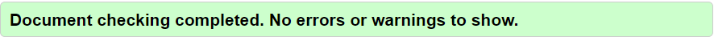
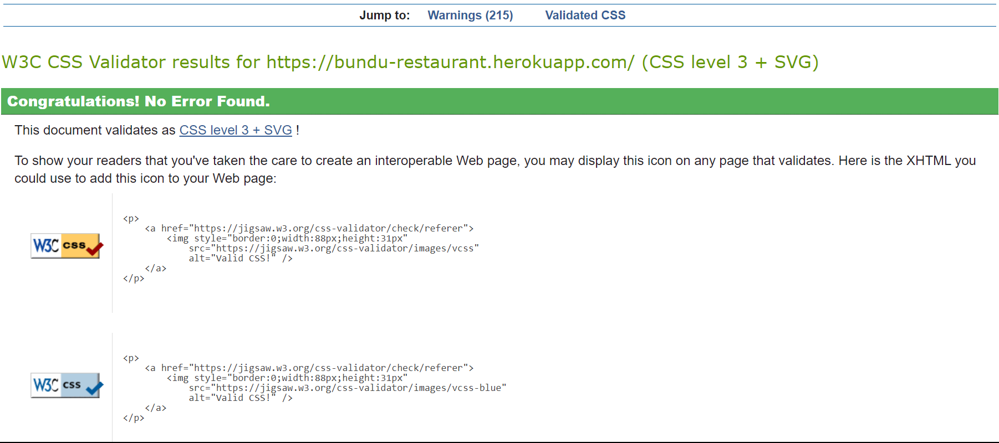
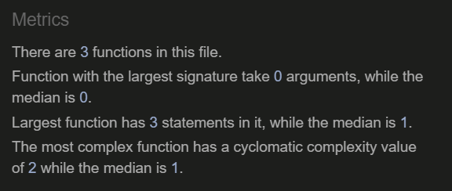
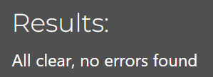
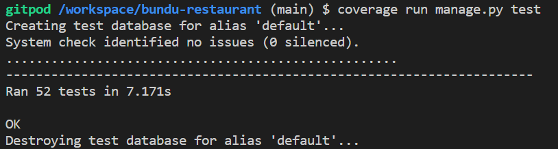
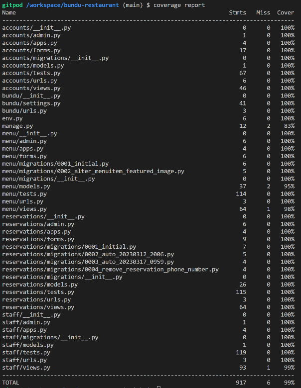

# Testing

## Code Validation
All code written for the project has been validated. The final validation results can be seen below.

### W3C HTML Validation Results
All HTML code has been run through the [W3C HTML Validator](https://validator.w3.org/).

* During validation, a few problems were presented but after correcting the relevant issues, no warnings or errors were shown.

    * For more information on the warnings and errors that were presented, please go to the known Bugs section.

All pages presented the following message after final validation.

### W3C CSS Validation Results
All custom CSS code has been run through the [W3C CSS Validator](https://jigsaw.w3.org/css-validator/).

* No errors were presented for custom css.
    * Warnings shown are in relation to bootstrap classes.

### JSHint Validation Results
All custom javascript code has been run through [JSHint](https://jshint.com/).

* No warnings or errors were presented.

### CI Python Linter Validation Results
All python code written by myself for this project was developed following PEP8 guidelines and was run through the [CI Python Linter](https://pep8ci.herokuapp.com/).

* All final python files presented no warnings or errors.

## Manual Testing
Throughout the development process, each user story was tested and developed using related acceptance criteria and tasks which can be found in the [kanbad board](https://github.com/users/Tony118g/projects/8).
To ensure correct functionality, I performed various extensive manual tests in relation to site goals and user stories. The site's resulting features are evidenced in the features section of the [readme](README.md) although a summary can be seen below for each epic. All tests proved successful. 

* ### Initial Django Setup
    * This was development related and all criteria was met.
    * Necessary packages were installed successfuly.
    * Config variables were successfully secured.
    * The site was deployed succesfully.

* ### Site Content Interaction
    * User authorization is handled throughout the site. Certain content is restricted to users depending on their role.
    * Different content and features are available depending on whether the user is:
        * Logged in or not.
        * Logged in as a customer.
        * Logged in as a staff member.
    * The relevant features and functionality for each user has been explained in the features section of the [readme](README.md).
    * If any user tries to access a page or feature that they are not authorized for, they are redirected and provided with a feedback message informing them of the restriction.
    * Any features that are not allowed for a certain user are not made available to them with the exception of the booking link which is available but will prompt users to login before booking.
    * If a user were to try access any features that they are not allowed to access, they would have to do it via the url which makes the attempt very unlikely.
        * Even if a user were to use the url to access a restricted feature, functionality is in place to prevent it from being fruitful.

* ### User Account Management
    * New users are able to fill in a form and register an account via a link in the navbar.
    * Once a user is registered, they can login and logout of the site as they please via links in the navbar which display a login form for logging in or a logout confirmation for logging out.
    * Registered users are able to view their profile page via a navbar link which contains information regarding their account details and reservations.
    * Registered users are also able to edit thier account details by clicking on the available option in their profile page and filling in a form to do so.
    * Logged in users are able to change their password via the link in the edit details page which will provide them with instructions to do so. If they follow the instructions, their password will be changed.
    * If users forget their password, there is a link in the login page to reset it. By clicking on the link and following instructions, they can successfully reset their password via an email link and instructions.
    * Regstered users are able to delete their account and all related reservations by clicking on the available option in their profile page and confirming the deletion.

* ### User Reservation Management
    * Logged in users are able to make a reservation request by filling in a form via a link in the navbar.
    * The status of reservations can be viewed in the user's profile page.
    * Once a staff member has responded to my request, the relevant user will receive an email in regards to the response and the status will be updated in their profile page.
    * In the profile page, users can view all of their reservations. If they click on a reservation, the full details are displayed for them to view.
    * If a user wishes to edit a reservation, they may do so by filling in a form via the option to edit displayed in each reservation along with the details. They cannot however edit any reservations that have past. Once a reservation has been edited, a message provides the user with relevant feedback.
    * If a user wishes to cancel/delete a reservation they may do so via the delete option displayed alongside the edit option. Once they confirm the deletion then the reservation is deleted and a message provides them with relevant feeback.

* ### Staff Reservation Management
    * Staff users have the ability to view all reservations in various ways.
        * They can view pending, approved and denied reservations via links within the reservations section of the staff dashboard.
        * They can search for approved reservations on certain dates.
        * They can search for any reservations pertaining to a specific name.
    * Staff users can approve or deny reservations by clicking the options to do so in either the pending reservations page or in a name search result if the resulting reservation is pending.
    * Staff are able to view any approved reservations for the current date by clicking on the available option in the staff dahsboard.

* ### Staff Menu Management
    * Staff members can manage all aspects of the menu via the menu management section in the staff dashboard. In the menu management section there are options to:
        * Add a menu item.
        * Manage the menu drafts page.
        * Manage the published menu on the site.
    * Staff users can add new menu items by filling in a form via a link in the staff dashboard and setting the item to published.
    * Staff users can also save menu items as drafts by performing the same action as adding a menu item but setting it to draft instead of pubished.
    * The option to edit menu items is available to staff users via links on each menu item in both the menu page and menu drafts page.
        * Once they fill in the relevant form and submit it, the menu item is updated.
    * The option to delete menu items is also available for each item. Once the option to delete an item is selected, the user is required to confirm the deletion. If the deletion is confirmed, the item is deleted.
    * When filling in a form to add or edit a menu item, the staff user has an option to mark the item as unavailable. If this is done then a label will appear to show that the item is not available.

* ### User Menu Interaction
    * All site users are able to view the menu via a link in the navbar.
    * Each menu item displays the title, description and price as well as whether or not it is available.
    * If a user clicks on a menu item then an image of the item is displayed to the user.

## Automated Testing

During development, I created automated tests for the main functionality of the project. I found this very beneficial in ensuring the site works as intended.

Tests were created for each app to test key features and functionality. I used [coverage](https://pypi.org/project/coverage/) to keep track of the amount of code my tests have covered and generated reports to find out which areas were untested so I could be sure to cover as much as possible.

I currently have 52 automated tests overall which all pass and provide 99% coverage for the project.

To run the automated tests, use the command - "python3 manage.py test"

